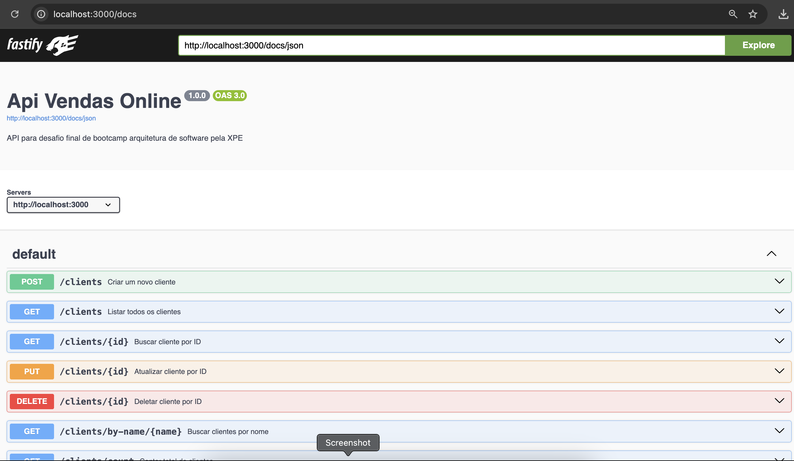
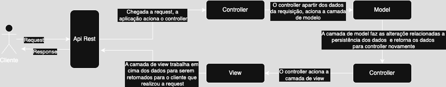
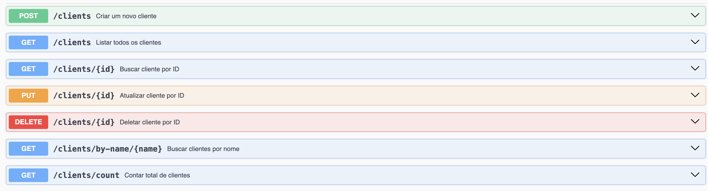
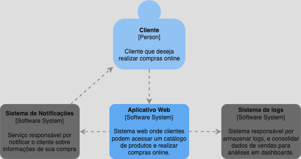
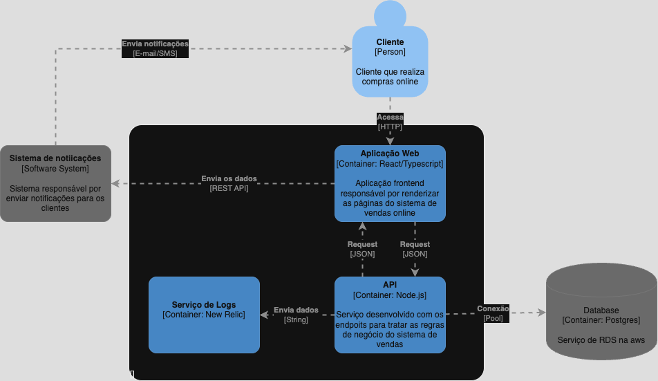
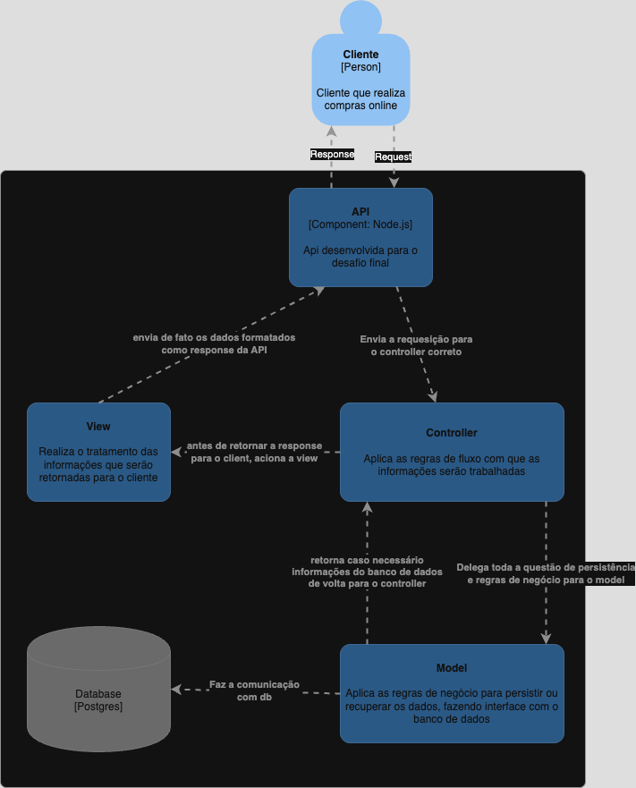
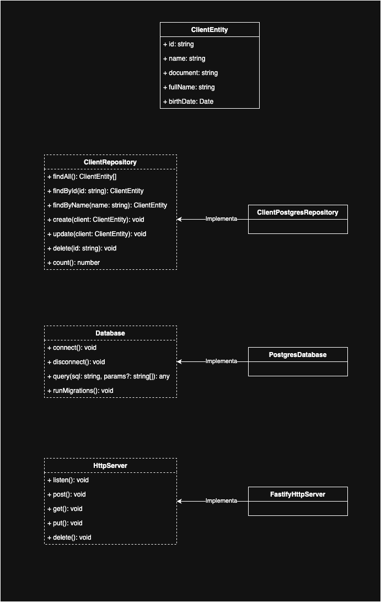

# Bootcamp Arquitetura de Software

Esse repositório contém o **desafio final** do primeiro bootcamp realizado na pós-graduação de Arquitetura de Software da XP Educação.

Projeto desenvolvido por: **Raphael de Oliveira Moura**

O desafio consiste na criação e documentação de uma solução para uma empresa de vendas online.



---

## Sumário

- [Enunciado](#enunciado)
- [Configurando o Projeto](#configurando-o-projeto)
  - [Preparando Ambiente](#preparando-ambiente)
  - [Executando o Projeto](#executando-o-projeto)
- [Detalhes do Projeto](#detalhes-do-projeto)
  - [Organização de Pastas](#organização-de-pastas)
  - [Fluxo de Dados](#fluxo-de-dados)
  - [Endpoints Desenvolvidos](#endpoints-desenvolvidos)
  - [Diagramas C4](#diagramas-c4)

---

# Enunciado

> Você é Arquiteto(a) de Software em uma grande empresa de vendas online.
>
> Sua responsabilidade é construir e implantar uma solução que disponibilize publicamente dados de Cliente/Produto/Pedido (algum domínio) aos parceiros da empresa.
>
> Para isso, será necessário projetar, documentar e implantar uma API REST, no padrão arquitetural MVC, que exponha um endpoint capaz de realizar um CRUD dos dados (e um pouco mais).

---

# Configurando o Projeto

## Preparando Ambiente

Primeiramente, será necessário fazer o download do `Docker` e do `Docker Compose`.

1. A maneira mais simples é baixar o [Docker Desktop](https://www.docker.com/products/docker-desktop/), que instala todas as ferramentas necessárias para rodar o Docker.

2. Caso prefira, você pode baixar separadamente o [Docker](https://docs.docker.com/engine/install/) e o [Docker Compose](https://docs.docker.com/compose/install/) de acordo com o seu sistema operacional.

---

Após instalar o Docker, clone o projeto na sua máquina:

```sh
# Clonando via HTTPS
$ git clone https://github.com/RaphaelOliveiraMoura/bootcamp-arquitetura-software-desf5.git

# Ou clonando via SSH
$ git clone git@github.com:RaphaelOliveiraMoura/bootcamp-arquitetura-software-desf5.git
```

> Para isso, é necessário ter o [Git](https://git-scm.com/downloads) instalado em sua máquina.

Alternativamente, é possível baixar os arquivos do projeto diretamente pela interface do GitHub, selecionando a opção `Download ZIP`.

## Executando o Projeto

Dentro da pasta do projeto, execute o comando:

```sh
$ docker-compose up
```

Após alguns segundos, acesse a URL [http://localhost:3000/docs](http://localhost:3000/docs) para verificar se o projeto está rodando corretamente. Essa URL abrirá uma tela com o Swagger, onde é possível:

- Visualizar todos os endpoints desenvolvidos
- Simular e realizar testes em cada rota

> **Importante:** A API é exposta na porta **3000** e o banco de dados na porta **5432**. Certifique-se de que essas portas estão livres antes de iniciar o projeto.

# Detalhes do Projeto

O projeto consiste em uma API REST desenvolvida utilizando [Node.js](https://nodejs.org/pt) com [TypeScript](https://www.typescriptlang.org/), e a biblioteca [Fastify](https://fastify.dev/) para criação do servidor.

A documentação da API foi feita com o `Swagger`, disponível em [http://localhost:3000/docs](http://localhost:3000/docs), permitindo a visualização de todos os endpoints do domínio `clientes`.


A persistência dos dados é realizada utilizando o banco de dados `Postgres`.

Toda a infraestrutura (banco de dados e API) é orquestrada pelo `Docker`, simplificando o processo de configuração e evitando a necessidade de instalações locais de Node.js e Postgres.

## Organização de Pastas

A arquitetura do projeto segue o padrão **MVC** (Model, View, Controller).

Estrutura de pastas:

```sh
📂 src
    📂 @shared
        📂 database        # Configurações de conexão com banco de dados + migrations utilizando Postgres
        📂 http-server      # Configurações do servidor HTTP com Fastify

    📂 controller            # Camada Controller do MVC

    📂 model                 # Camada Model do MVC
        📄 *.entity.ts       # Definição/tipagem das entidades
        📄 *.repository.ts   # Regras de persistência das entidades

    📂 view                  # Camada View do MVC
```

## Fluxo de Dados

Diagrama com o fluxo de dados nas camadas da aplicação:



## Endpoints Desenvolvidos



## Diagramas C4

### C4 - Contexto



### C4 - Container



### C4 - Componente



### C4 - Classe


